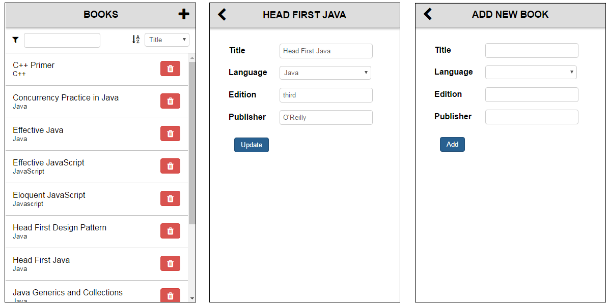

# Curso de Hybreed

## Contenido del curso

### Día 1
- Instalación de herramientas
- Explicación del stack tecnológico: Gulp, Browserify, Browsersync, json-server...
- ES6
- Underscore
- Backbone: modelos y colecciones
- Maquetación básica, scrolls
- SASS

### Día 2
- Marionette 3
- Views de Marionette
    - Mostrar contenido estático
    - Representar un modelo de Backbone
    - Regiones (layouts)
    
### Día 3
- CollectionViews de Marionette
    - Representar una colección de modelos
    - Lo anterior, pero con otros elementos integrados en la vista
    
### Día 4
- Layouts complejos para phone y tablets con medias queries

### Día 5
- Hybreed
- Ejemplo de aplicación de Hybreed que muestra información de la saga Star Wars a partir del servicio REST [SWAPI](https://swapi.co/).
- Se provee un ejemplo con las películas, se explicará cómo hacerlo con personajes y se practicará haciéndolo con planetas.

### Día 6
- Desarrollar en Hybreed una aplicación para phone de gestión de libros



Tome de guía los siguientes pasos:

1. Cree en el módulo `CMS` un gestor libros con una función que devuelva la colección de libros almacenados en el servicio.

2. Cree un módulos `books` que liste los libros (en esta fase no hace falta que esté el filtro, el control de ordenación y los botones de eliminar).

3. Cree un módulo `bookDetails`, que se mostrará el detalle del libro que se pulse desde la pantalla anterior.

4. Implemente la lógica de actualización de los campos del libro (un nuevo método `saveBook` en el módulo `CMS` debe ser el encargado de sincronizar el libro con el servidor).

5. Reutilice el módulo anterior para añadir nuevos libros. Pista: un libro nuevo aún no tiene su atributo `id` definido (porque aún no se ha sincronizado con el servidor).
 
6. Implemente la eliminación de libros desde el listado (un nuevo método `deleteBook` en el módulo `CMS` debe ser el encargado de sincronizar borrado del libro en el servidor).

7. Implemente las funcionalidades de filtro y ordenación de libros.

8. Probablemente no haya contado con que si el listado de libros está en un estado (filtro, ordenación, posición de scroll) y va a un detalle y luego vuelve, el estado del listado se resetea. Guarde el estado en que se encontraba el listado para reestablecerlo al volver a él.

### Día 7
- Terminar la aplicación anterior
- Repaso general y resolución de dudas

### Dia 8
- Examen

## Instalación

1. Instalar [node.js](https://nodejs.org/).

2. Instalar las dependencias globales y locales del proyecto
```
npm install -g gulp-cli json-server
npm install
```

## Ejecución

- Ejecute el modo de desarrollo:
```
gulp
```

- Configure en `src/main.js` y `src/main.scss` los recursos del ejercicio con el que va a trabajar.

## Configuración del proyecto en Webstorm

- Excluir la carpeta `node_modules` de la indexación.

- Configurar el proyecto para que interprete ES6 (pero sin transpilar).